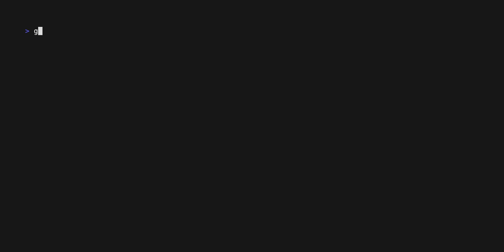
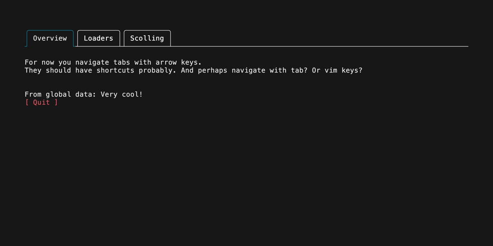

# BubbleApp

> [!WARNING]
> This is work in progress and just exploration for now

An opinionated App Framework for BubbleTea. Building large BubbleTea apps can be a lot of manual work. For every state of the app you need to store that state in your model and branch accordingly.

With BubbleApp you can compose models and gain things like

- **Composable Components** -
- **Mouse support** - using [BubbleZone](https://github.com/lrstanley/bubblezone)
  - Propagate mouse events to the right component automatically
- **Focus management**
  - Tab through your entire UI tree without any code
- **Global Ticks** that all components share (for animations like loaders)
  - Adding several Spinners from Bubbles is really slow over SSH. Each have their own Ticks.

## Examples

### [Hello World!](./examples/hello-world/main.go)

```go
stack := stack.New(ctx)
stack.AddChildren(
    text.New(ctx, "Hello World!"),
    divider.New(ctx),
    text.New(ctx, "Press [q] to quit."),
)

base := app.New(ctx, app.AsRoot())
base.AddChild(stack)

return model{
    base: base,
}
```



---

### [Multiple Views](./examples/multiple-views/main.go)


---

### [Tabbing](./examples/tabbing/main.go)

```go
boxFill := box.New(ctx)

addButton := button.New(ctx, "Button 1",
    button.WithVariant(button.Primary),
)

quitButton := button.New(ctx, "Quit App",
    button.WithVariant(button.Danger),
)

stack := stack.New(ctx)
stack.AddChildren(
    text.New(ctx, "Tab through the buttons to see focus state!"),
    addButton,
    boxFill,
    divider.New(ctx),
    quitButton,
)

base := app.New(ctx, app.AsRoot())
base.AddChild(stack)
```

```go
case button.ButtonPressMsg:
    switch msg.ID {
    case m.quitButtonID:
        return m, tea.Quit
    case m.addButtonID:
        m.base.GetChild(m.containerID).Base().AddChild(
            text.New(m.base.Ctx, "Button pressed"),
        )
        return m, nil
    }
```


---

### [Stack](./examples/stack/main.go)

```go
stack := stack.New(ctx)
stack.AddChildren(
    box.New(ctx, box.WithBg(ctx.Styles.Colors.Danger)),
    box.New(ctx, box.WithBg(ctx.Styles.Colors.Warning)),
    box.New(ctx, box.WithBg(ctx.Styles.Colors.Success)),
)

base := app.New(ctx, app.AsRoot())
base.AddChild(stack)
```


---

### [Tabs](./examples/tabs/main.go)

```go
var tabsData = []tabs.TabElement{
	{
		Title: "Overview",
		Content: func(ctx *app.Context) app.UIModel {
			return NewOverview(ctx)
		},
	},
	{
		Title: "Loaders",
		Content: func(ctx *app.Context) app.UIModel {
			return NewLoaders(ctx)
		},
	},
	{
		Title: "Scolling",
		Content: func(ctx *app.Context) app.UIModel {
			return NewScrolling(ctx)
		},
	},
}
```

```go
	tabs := tabs.New(ctx, tabsData)

	base := app.New(ctx, app.AsRoot())
	base.AddChild(tabs)
```



---

### [Grid](./examples/grid/main.go)

```go
// This does look a bit messy. Maybe there is a better way.
gridView := grid.New(ctx)
gridView.AddItems(
    grid.NewItem(box.New(ctx, box.WithBg(ctx.Styles.Colors.PrimaryDark), box.WithChild(
        text.New(ctx, "I wish I could center text! Some day...")),
    ), grid.WithXs(12)),
    grid.NewItem(box.New(ctx, box.WithBg(ctx.Styles.Colors.Warning)), grid.WithXsv(6)),
    grid.NewItem(button.New(ctx, "BUTTON 1", button.WithVariant(button.Success)), grid.WithXs(6)),
    grid.NewItem(button.New(ctx, "BUTTON 2"), grid.WithXs(3)),
    grid.NewItem(box.New(ctx, box.WithBg(ctx.Styles.Colors.InfoDark), box.WithChild(
        stack.New(ctx, stack.WithChildren(
            text.New(ctx, "I am in a stack!"),
            loader.New(ctx, loader.Meter, loader.WithText("Text style messes up bg. Fix!"), loader.WithColor(ctx.Styles.Colors.Black))),
        ),
    )), grid.WithXs(6)),
    grid.NewItem(box.New(ctx, box.WithBg(ctx.Styles.Colors.Success)), grid.WithXs(3)),
)

base := app.New(ctx, app.AsRoot())
base.AddChild(gridView)
```


